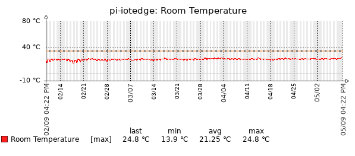
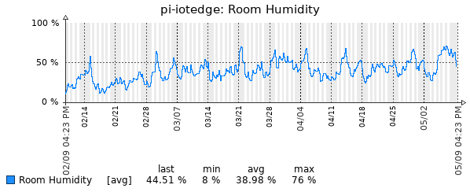
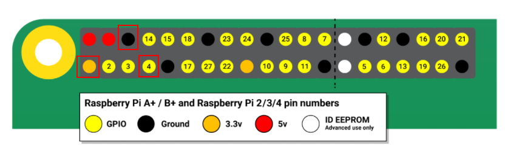

# Summary

The temperature and humidity collected by the DHT11 sensor connected to the Raspberry Pi are sent to Zabbix Server via Zabbix Sender.

Monitoring example (Zabbix Graph):



# Quickstart

SSH to raspi and put below commands.

```
$ sudo su
# git clone https://github.com/coleyon/dht11-raspi-zabbix-sender.git
# cd ./dht11-raspi-zabbix-sender
# pip install -r requirements.txt -t ./
# nohup pipenv run python3 -m main &> /var/log/raspi-dht11/stdout.log &
```

## logrotation example

```
# cat /etc/logrotate.d/raspi-dht11
/var/log/raspi-dht11/stdout.log {
        daily
        rotate 1
        missingok
        notifempty
        create 644 root root
}
# 
# # HOW TO TESTS LOTATING
# logrotate -f -v /etc/logrotate.d/raspi-dht11
```

# Env var

| key             | descr                                       | default value |
| --------------- | ------------------------------------------- | ------------- |
| GPIO_PIN_NUMBER | which GPIO pin connect to the DHT11 out pin | 4             |
| SEND_FREQ       | Zabbix Sender sending frequency (sec)       | 60            |
| LOCAL_HOST      | hostname or IP addr of monitored host       | 127.0.0.1     |
| ZABBIX_SERVER   | hostname or ip addr of zabbix server        | 172.0.0.1     |
| ZABBIX_PORT     | port number of zabbix server                | 10051         |
| LOG_LEVEL       | loglevel for stdout                         | DEBUG         |


# Environment

## Zabbix

* Zabbix Server 2.2 or higher

## Zabbix Monitoring Settings

The Zabbix server allows receiving [zabbix-sender packets](https://www.zabbix.com/documentation/2.2/jp/manual/concepts/sender).

**Host:**

* Host name: `ip address of raspberry pi`
* Agent interfaces:
  * IP address: `ip address of raspberry pi`
  * Connect to: IP
  * Port: 10050

**Application**

* Name: dht11

**Item for Humid**

* Name: Room Humidity
* Type: Zabbix trapper
* key: humid
* Type of information: Numeric (float)
* Units: %
* Applications: dht11

**Trriger for Humid Examples**

* Name: Room Tempereture is too High or Low
* Expression: `{ZabbixSenderSensing:temp.last(#5,1)}>30 or {ZabbixSenderSensing:temp.last(#5,1)}<20`

**Item for Temp**

* Name: Room Temperature
* Type: Zabbix trapper
* key: temp
* Type of information: Numeric (float)
* Units: Celsius
* Applications: dht11

**Trriger for Temp Examples**

* Name: Room Humidity is too High or Low
* Expression: `{ZabbixSenderSensing:humid.last(#5,1)}>75 or {ZabbixSenderSensing:humid.last(#5,1)}<40`

## Raspbrry Pi OS env

**Hardware**

Raspberry Pi 4 model b - https://www.raspberrypi.org/products/raspberry-pi-4-model-b/

**Configs**

Installation of requirements packages.

```bash
## setup
$ sudo apt-get update
$ sudo apt-get install -y apt-transport-https git
$ sudo apt-get install -y lm-sensors    # for temperetures sensing
$ pip3 install --upgrade pip
$ pip3 install pipenv                   # if you use pipenv instead of pip

## versions
$ cat /etc/issue
Raspbian GNU/Linux 10
$ uname -r
4.19.97-v7l+
$ cat /etc/debian_version 
10.3
$ python3 --version
Python 3.7.3
$ pip3 --version
pip 20.2.2 from /usr/local/lib/python3.7/dist-packages/pip (python 3.7)
```


## Sensor module and connection

* Model: DHT11 - http://www.aosong.com/en/products-21.html
* Connect to: Raspberry Pi 4 GPIO - https://www.raspberrypi.org/documentation/usage/gpio/README.md


| DHT11 | Raspi  |
| ----- | ------ |
| VDD   | 3.3V   |
| DATA  | GPIO4  |
| NC    | --     |
| GND   | Ground |


